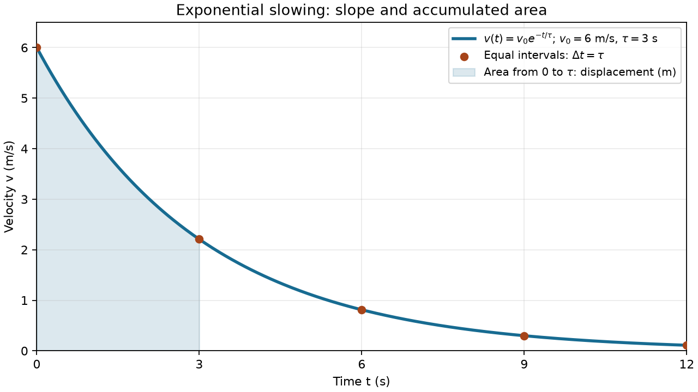

# 学习单：指数减速运动中的特征时间、对数与位移积分

> 本次是正式教学：先讲解和示范，再逐题练习。2026-09-07 开始，2026-09-09 完成本次实际课堂范围的批阅；计划时长 90 分钟，未测量实际用时。保留原题、首次作答和提示后订正，未覆盖项见批阅；reviewed 不代表 MC-01 已独立达标。

## 本次目标

- 解释指数减速中“等时间减少相同比例”和特征时间的物理意义。
- 用对数从剩余速度比例反求时间，检查对数输入与指数是否无量纲。
- 从速度函数得到加速度及区间位移，并联系图像斜率、面积和单位。
- 形成 `MC-01` 的教学与练习记录；本次不承诺完整目标独立达标，也不开展新一轮基线评估。

## 前置检查

- 已有基线表明：基本位置求导、速度与加速度单位、定积分表示累积量的直觉可以直接承接。对数、特征时间和指数原函数需要正式教学，不重复检验这些已知薄弱点。
- 时间分配：关系回顾 5 分钟，指数图像 15 分钟，对数反求 20 分钟，求导与积分 20 分钟，练习 25 分钟，复述与英文图注 5 分钟。
- 在讲解复合函数求导前，先用一句短练习确认 $u=t/T$ 对 $t$ 的导数；明确说忘了或不会就立即讲解，不作为独立测验或推进门槛。
- 本次可以使用计算器计算对数和指数，但先写关系再近似；不要求写 Python。学得慢时继续使用本学习单，不为凑齐环节压缩讲解。
- 2026-09-07 开始聊天教学：首段讲解位置、速度、加速度的联系，结合示例图引入指数减速和特征时间；尚未收到练习作答，其余内容按互动继续展开。

## 学习内容

### 运动场景与关系回顾（5 分钟）

一辆小车沿直线向正方向运动，速度逐渐减小。我们已经有一个描述速度变化的函数，现在研究：它何时减慢到指定比例？这段时间走了多远？

选定原点和正方向后，位置为 $x(t)$，速度和加速度分别为

$$
v(t)=\frac{dx}{dt},\qquad a(t)=\frac{dv}{dt}.
$$

速度是位置随时间的变化率，加速度是速度随时间的变化率。它们的单位分别为 $\mathrm{m/s}$ 和 $\mathrm{m/s^2}$。速度图像的斜率表示加速度，速度图像与时间轴之间的有向面积表示位移：

$$
x(t_2)-x(t_1)=\int_{t_1}^{t_2}v(t)\,dt.
$$

路程累计的是 $|v|$。本次速度一直为正，故路程与位移大小相同；发生反向运动时不能直接沿用这一结论。

### 指数图像与特征时间（15 分钟）

本次给定运动模型

$$
v(t)=v_0e^{-t/\tau},\qquad t\ge0.
$$

| 符号或条件 | 含义与单位 |
|---|---|
| $t$、$x(t)$、$v(t)$ | 时间、位置、速度；单位分别为 $\mathrm s$、$\mathrm m$、$\mathrm{m/s}$ |
| $v_0>0$ | 固定参数，也是 $t=0$ 的初速度，单位 $\mathrm{m/s}$ |
| $\tau>0$ | 固定的特征时间，单位 $\mathrm s$ |
| $x(0)=x_0$ | 初始位置，单位 $\mathrm m$；需要绝对位置时必须给定 |
| 适用条件 | 一维连续运动，$v_0$ 和 $\tau$ 固定；模型给定，不在本次推导其受力来源 |

$t/\tau$ 是“已经过去多少个特征时间”，因此没有单位；指数的输入必须无量纲。$e\approx2.718$ 是自然指数的底。

每隔相同的 $\Delta t$，速度都乘上相同的比例：

$$
\frac{v(t+\Delta t)}{v(t)}=e^{-\Delta t/\tau}.
$$

特别地，每经过一个 $\tau$，速度变为此前的 $e^{-1}\approx0.368$。这不是减去一个固定的速度，也不是在 $\tau$ 时停下。固定比例对应的绝对减少量会随原有速度变小而变小。

下面是 AI 制作的教学示例，使用 $v_0=6\,\mathrm{m/s}$、$\tau=3\,\mathrm s$，不属于学习者成果。



- 横轴为时间，纵轴为速度。相邻标记点时间间隔相同，但纵向落差越来越小。
- 曲线始终在时间轴上方、斜率为负，并逐渐变平：小车一直向正方向运动，减速越来越缓。
- 对同一初速度，$\tau$ 越大，达到同一剩余比例需要的时间越长。有限时刻速度仍大于零；趋于零是模型的长期极限，实际小车还可能受到模型未包含的摩擦等影响。

### 对数：从剩余比例反求时间（20 分钟）

自然对数 $\ln$ 是自然指数的逆运算：$e^y=r$ 等价于 $y=\ln r$，要求 $r>0$。对数作用于比例等无量纲量，不能直接对带单位的速度取对数。

示范使用不同场景：某传感器的归一化信号为 $r(t)=e^{-t/T}$，其中 $T=5\,\mathrm s$。求信号降到初值一半所需时间。

先写剩余比例，再对两边取自然对数：

$$
e^{-t/T}=\frac12,
\qquad -\frac{t}{T}=\ln\!\left(\frac12\right),
\qquad t=-T\ln\!\left(\frac12\right)=T\ln2\approx3.47\,\mathrm s.
$$

检查：$\ln(1/2)<0$，所以算出的时间为正；$T$ 提供时间单位。把结果代回指数，应该恢复 $1/2$。这里 $T$ 的单位始终为秒，近似值来自计算器。

对减速问题也是先用“目标速度除以初速度”得到剩余比例，再反求时间。不要把初始速度的数值与剩余比例相乘后塞进对数。

### 求导、积分与位移（20 分钟）

复合函数是把一个函数的输出送入另一个函数。链式法则要求把外层变化率和内层变化率相乘。以带单位的温度示例 $f(t)=A e^{t/T}$ 为例，$A$ 单位为 $\mathrm K$、$T$ 单位为秒：

$$
\frac{df}{dt}=A e^{t/T}\frac1T.
$$

外层指数函数求导后保持指数形式，内层 $t/T$ 求导带来 $1/T$。结果单位为 $\mathrm{K/s}$。当内层是 $-t/T$ 时，内层导数也带负号。

积分可以从“找一个导数等于被积函数的函数”开始。若 $k\ne0$ 是常量，则

$$
\int A e^{kt}\,dt=\frac{A}{k}e^{kt}+C.
$$

这是因为对右侧求导会乘回 $k$。当 $t$ 有时间单位时，$k$ 必须具有时间倒数单位；$k=0$ 时被积函数为常量，应另用 $At+C$。

用不同于运动练习的示范熟悉负系数：容器流入速率为 $q(t)=Qe^{-2t/T}$，其中 $Q=4\,\mathrm{L/s}$、$T=6\,\mathrm s$。求前 $3\,\mathrm s$ 流入体积。

$$
F(t)=-\frac{QT}{2}e^{-2t/T},\qquad F'(t)=q(t),
$$

$$
\Delta V=F(3\,\mathrm s)-F(0)
=\frac{QT}{2}\left(1-e^{-1}\right)
\approx7.59\,\mathrm L.
$$

先写原函数，再做“上限减下限”，最后检查单位和大小：$(\mathrm{L/s})\mathrm s=\mathrm L$，实际流入量小于始终保持初速率时的 $12\,\mathrm L$。积分常数在上下限相减时抵消。

回到运动问题：对速度求导得到加速度，对速度在给定时间区间积分得到位移；若要求位置，还要加上初始位置。本次练习由学习者完成这两步。

### 复述与专业英语（5 分钟，练习后进行）

用自己的话解释：特征时间描述什么；速度图像的斜率与面积分别描述什么；为什么减速时加速度可以为负而位移仍为正。

以下是 AI 自拟教学图注，并非外部引文：

> The velocity decreases exponentially. The shaded area under the velocity–time curve represents displacement.

结合图像理解 `velocity`（速度）、`decreases exponentially`（按指数减小）、`shaded area`（阴影面积）和 `displacement`（位移），再用中文复述图注，不背孤立词表。

## 练习

> 共约 25 分钟，一次呈现一道。可查阅本次教学内容，记录实际使用的提示。这里只给题目，不附答案。

### 练习一：速度比例与时间（约 10 分钟）

一辆沿直线正向运动的小车满足 $v(t)=v_0e^{-t/\tau}$，其中 $v_0=10\,\mathrm{m/s}$、$\tau=4\,\mathrm s$、$t\ge0$。

1. 用自己的话解释 $\tau=4\,\mathrm s$ 的含义，以及等长时间段内减少的比例与绝对速度量是否相同。
2. 求速度第一次降到 $2\,\mathrm{m/s}$ 的时刻。先写比例方程和精确表达式，再给近似值与单位；代回原函数核对。
3. 比较 $0$ 至 $4\,\mathrm s$、$4$ 至 $8\,\mathrm s$ 两段速度图像的陡缓及速度减少量，说明理由。

### 练习二：从速度到加速度、位移与位置（约 15 分钟）

另一辆小车满足 $v(t)=u_0e^{-t/T}$，其中 $u_0=8\,\mathrm{m/s}$、$T=2\,\mathrm s$、$x(0)=1\,\mathrm m$、$t\ge0$。

1. 求加速度函数，并解释其符号、单位，以及随时间变化的趋势。
2. 求 $1\,\mathrm s$ 至 $3\,\mathrm s$ 的位移，写出积分、原函数、上下限代入和结果单位；通过求导核对原函数。
3. 求 $x(3\,\mathrm s)$，说明为什么不能把第 2 问的位移直接加到 $x(0)$ 上。
4. 用端点速度乘以区间时长，给第 2 问的位移建立上下界，检查数量级；解释这段运动的路程与位移大小是否相等。

## 用户结果

### 特征时间课堂理解检查（2026-09-07）

- 已提供的教学：指数减速模型、经过一个特征时间剩余约 36.8%、等时间乘相同比例，并展示速度图像与示例数据。
- 题目：两辆车初速度相同，甲的特征时间为 2 秒，乙为 5 秒，哪辆车先降到初速度的约 36.8%，哪辆减速更快？
- 学习者原答：“甲，甲减速快。”
- 即时反馈：选择正确；甲在 2 秒达到该比例，乙在 5 秒达到。尚未提交解释过程；这是教学后的局部理解检查，不据此判定整个 MC-01 独立达标。
- 当时仅提交上述课堂作答，学习单转为 submitted；后续作答和最终批阅见下文。

### 练习一：时间反求分问（2026-09-07）

- 已提供的教学：自然对数的逆运算含义，以及归一化信号在 T=5 秒时反求剩余一半所需时间的完整示范。
- 本次仅呈现练习一第 2 问：初速度 10 m/s、特征时间 4 秒，求速度降到 2 m/s 所需时间；要求先列比例方程，可保留对数形式。
- 学习者原答：“4ln5”。
- 即时反馈：表达式正确，补充单位为秒；AI 核验约为 6.44 秒，代回后剩余比例为 1/5。学习者未提交比例方程、推导、单位或小数值，不能把 AI 补充的部分作为其成果。
- 这是同类例题教学后的应用，尚不足以单独判定 MC-01 已独立达标。练习一其余分问和练习二仍待完成，下一环节进入求导教学所需的短前置确认。

### 链式法则前置确认与补讲（2026-09-07）

- 题目：若 u(t)=t/T，T 为不随时间变化的常量，求 du/dt。
- 学习者原答：“这里我忘记复合函数求导公式了。”
- 教学响应：暂停求导练习，补讲复合函数 y=f(g(t)) 的链式法则及内外层变化率相乘的含义；明确 t/T 的导数为 1/T，再用 y=exp(2t/T) 示范，随后只尝试运动模型内层 -t/τ 的导数。
- 该自述说明当前需要复习链式法则，不据此推断其不会常数倍函数求导，也不将未验证的链式法则能力登记为已掌握或 needs_refresh。
- 补讲后的内层练习：求 u(t)=-t/τ 的导数，τ 为固定常量。学习者原答：“负淘分之一”。按上下文理解为 $-1/\tau$，结果正确；属于上述方法讲解后的局部应用，尚未完成整个速度函数求导。

### 教学方式纠正与完整求导练习（2026-09-07）

- AI 随后给出外层导数和两层相乘框架，提示过多。学习者原话：“你又直接喂嘴里了”。后续改为讲清方法后提供完整任务，留出自行组织推导的空间，遇到具体困难再按需提示。
- 新练习：$v(t)=V(1-e^{-t/T})$，$t\ge0$，$V>0$ 单位为 m/s、$T>0$ 单位为秒，均为常量；求加速度，写出推导，并解释加速或减速。新题呈现时未再给步骤提示。
- 学习者原答：“V/T\\*e^(-t/T)\n在加速”。此处保留消息中的转义及换行表达，不作为可运行代码。
- 即时反馈：加速度表达式 $a(t)=(V/T)e^{-t/T}$ 正确；对 $t>0$，速度与加速度均为正，速率增加，$t=0$ 从静止开始向正方向加速。AI 补充单位为 m/s²；学习者未展示推导和单位，不替其补写成果。
- 本题是在链式法则教学后、未再给本题提示时提交的正确结果；与此前原题的框架提示分开记录，尚不据此升级完整 MC-01。后续继续解释速度与加速度的变化关系，再进入积分教学。
- 后续物理解释题：物体一直加速，速度是否无限增大？要求结合速度或加速度表达式说明理由，未提供步骤提示。
- 学习者原答：“不会无限增大，t区域无穷时，a趋于0，因此一定会有一个终速度。从速度函数看，t趋于无穷时，速度趋于V。”
- 对上述理由区别和反例补讲，学习者回复：“明白了”。该回复仅记录为理解自述，不作为已独立修正推理的证据。
- 即时反馈：由速度函数得出速度趋于 V 正确；但 a 趋于零不足以保证速度有有限极限，两段理由必须区分。通过另一个模型 $v(t)=U\ln(1+t/T)$、$a(t)=U/[T(1+t/T)]$（U、T 为正的速度与时间常量）说明：加速度可趋零而速度仍无界；这属于 AI 补充教学，不是学习者自行发现的反例。随后用加速度累积对应速度变化，引入定积分。

### 练习二：区间位移首次作答（2026-09-09）

- 已提供的教学：定积分的累积意义、指数函数原函数，以及另一个流量模型的完整积分示范。本题要求计算速度模型在 1 秒至 3 秒之间的位移，并检查单位和数量级，未进一步拆解作答步骤。
- 学习者原答：

  ```text
  F(t) = -u0Te^(-t/T)
  F3-F1 = 16(e^0.5-e^1.5)
  单位是m
  ```

- 即时反馈：原函数、使用 F3-F1 的思路及单位均正确；代入后指数的负号丢失，写出的位移为负，与本题速度始终为正不符。仅提示回看原函数指数 -t/T 的符号，要求自行重新代入并检查位移正负；不提供订正后的表达式或数值。
- 学习者订正原答：“0.5和1.5变负的。\n这段位移应该是正的。”
- 订正反馈：指数符号与位移正负判断均已改正；按其订正，表达式为 $16(e^{-0.5}-e^{-1.5})\,\mathrm m$。这是符号提示后的同题订正，不覆盖首次作答，也不作为无提示等价任务闭环。
- 随后要求给出近似值并解释数量级是否合理，学习者回复：“你直接告诉我吧”。因此本分问改为完整讲解。
- AI 使用 Python math 核验：位移约 6.1344 m，1 秒与 3 秒时的速度分别约 4.8522 m/s 与 1.7850 m/s。区间内速度为正且单调减小，持续 2 秒，故位移介于 3.5701 m 与 9.7045 m 之间，所得约 6.13 m 符合此界。
- 状态：本分问数值和上下界检查由 AI 在明确请求后完整提供，帮助程度为 solution，不计为学习者独立成果。原函数正确与提示后符号订正仍分别保留；后续若需独立证据，应另用等价任务验证。
- 对数值和上下界检查讲解，学习者回复：“明白了”。只记录为理解自述，未新增独立检查证据。
- 下一分问进入原练习二第 3 问：同一速度模型，给定 x(0)=1 m，求 x(3 s)，允许保留指数表达式；完整呈现题目，不提供积分区间或代入步骤。

### 练习二：位置分问首次作答（2026-09-09）

- 题目：沿用初速度 8 m/s、特征时间 2 秒的指数减速模型，给定 x(0)=1 m，求 x(3 s)，要求写过程，可保留指数形式。本分问未提示积分区间或代入步骤。
- 学习者原答：

  ```text
  算出0-3秒的位移，根据之前的原函数，可以计算位移。位移得到之后，加上初位置，就知道末位置了。
  原函数F3=16e^-1.5 F0=16e^0=16
  位移就是16-16e^-1.5
  位置再+1就行。
  ```

- 即时反馈：正确选择 0 至 3 秒累计位移并加初位置，最终位移与位置表达式正确；但 F3、F0 都遗漏此前原函数的外部负号，写出的中间函数值不能按 F3-F0 得到其最终位移。不能因最终答案正确忽略过程不一致，也不据此否定区间选择与位置关系的正确理解。
- 仅提示原函数外部负号及过程一致性，要求自行订正两个函数值并写明相减顺序；未提供订正后的函数值。等待该局部订正，暂不登记完整 MC-01 独立达标。
- 学习者订正原答：

  ```text
  原函数F3=-16e^-1.5 F0=-16e^0=-16 &#x20;
  F3-F0 = -16e^-1.5+16
  ```

- 订正反馈：函数值的外部负号与上限减下限的顺序均已正确，位置表达式由此前所述再加初位置得到。属于最小提示后的同题订正，未进行无提示等价任务闭环。
- 后续进入本次收尾的简短英文图注：先提供必要词义，再请用中文复述物理含义，不将英语作为单独能力评级。

### 英文图注复述（2026-09-09）

- 已提供本学习单中的两句英文图注，以及 decreases exponentially、shaded area、represents、displacement 的中文词义，要求复述物理含义。
- 学习者原答：“速度按指数减小。这个在速度时间曲线下方的阴影面积表示位移。”
- 即时反馈：两句含义均正确；补充阴影覆盖的时间区间与位移区间对应。本题速度为正，不涉及负速度时有向面积与路程的区别。记录为词义支持下的图注理解，不另评级英语，也不作为无辅助英文阅读证据。

## AI 批阅

### 正式批阅（2026-09-09）

本次完成指数运动、特征时间、对数反求、链式法则、指数原函数、区间位移与位置关系的教学，并对实际提交的课堂练习完成反馈与同题订正。工作流结论为 reviewed，MC-01 证据为 guided；本次不执行阶段退出审计。

| 内容 | 实际表现与帮助 | 判定 |
|---|---|---|
| 特征时间与对数 | 教学后正确判断较小特征时间对应较快减速，并给出时间反求式 4ln5；未提交完整推导或单位 | 保留正确局部结果，不推定整个概念已独立掌握 |
| 复合函数求导 | 明确表示忘记公式后接受补讲；换题后正确给出增长型速度的加速度表达式与加速判断，未再收到本题步骤提示 | 区分原题的过度框架提示和换题的正确结果；未展示推导与单位 |
| 长期极限 | 正确从速度函数得到极限 V，但同时误用 a 趋零必有有限终速度的推断；AI 用反例补讲 | “明白了”仅为理解自述，尚需另题复核该推理 |
| 区间位移 | 自行给出正确原函数、上限减下限的思路及米的单位；代入时指数负号丢失，最小提示后订正 | 方法入口正确，符号执行需巩固，同题订正不算独立闭环 |
| 位移大小检查 | 学习者明确要求直接告知后，AI 提供约 6.13 m 及端点速度上下界；数值经 AI Python 核验 | 属于 solution，不计学习者独立计算或检查成果 |
| 位置关系 | 自行选择 0 至 3 秒积分并加初位置，最终表达式正确；原函数外部负号遗漏，提示后订正过程 | 位置与区间选择的理解正确，仍需无提示检查符号一致性 |
| 图像与英文 | 词义支持下正确复述指数减速及速度图下阴影表示位移 | 有支持的课堂理解，不外推至陌生图像或无辅助英文材料 |

实际覆盖说明：练习一第 1 问只用课堂特征时间比较部分覆盖，第 3 问未单独作答；练习二第 1 问改用增长型速度函数教学和练习，不冒充原题已作答；第 2、3 问已反馈并订正；第 4 问的上下界检查改为 AI 讲解，路程与位移比较未取得学习者解释。收尾用图注复述，未执行全部预设口头复述项。这些保留为后续练习素材和证据缺口，不为凑齐原题继续延长本次教学。

正负号错误属于代入和过程一致性问题，不能抹除已展示的积分方法与位置关系理解。教学开始时过度拆步的问题已按学习者反馈调整：讲清方法后呈现完整任务，遇到具体困难再提示。

| target_id | help | evidence_state | evidence | correction_closure | review_debt |
|---|---|---|---|---|---|
| MC-01 | solution | guided | [用户结果](#用户结果)：教学后给出正确对数结果、增长型速度的导数及指数原函数，能选择区间位移与初位置关系；符号需提示订正，数量级检查由 AI 完整讲解，图注有词义支持 | open: 已完成两处同题符号订正，未用等价任务无提示闭环 | 后续用新题复核负号、上下限、单位、速度极限的论证及位移范围；补充图像斜率和路程区别，取得独立证据后再安排延迟复核 |

## 下一步

- 本次实际课堂范围已完成批阅，MC-01 保持 guided，未完成无提示等价任务闭环；不将听懂、同题订正或 AI 计算当作独立能力。后续补练须保留本学习单的首次结果与帮助记录。
- 按[当前执行板](../../../state/current.md#每周课程轮换)轮换到 `LS-01` 正式教学，从二维物理量、两个未知量的线性关系引入向量与矩阵，不要求先测验通过；后续计算课使用已讲过的指数模型，训练采样、图像单位和数值累计位移，并复核本次符号与范围检查缺口。
- 本轮指数模型计算不替代 `MC-04` 的简谐运动迁移复核；先教学新模型，再按执行板保留的复核债务安排。`MC-02` 斜面独立建模评估后置。

## 相关项目与资料

- [当前学习状态与课程轮换](../../../state/current.md)
- [运动与变化阶段契约](../../../roadmap/01-motion-linear-systems.md#motion-change)
- [基线退出评估中的教学起点](2026-09-02-baseline-exit-assessment.md#ai-批阅)
- [AI 教学配图生成脚本](../../../projects/exponential-motion-calculus/teaching_plot.py)：本次教学材料，不是学习者科学计算成果。
